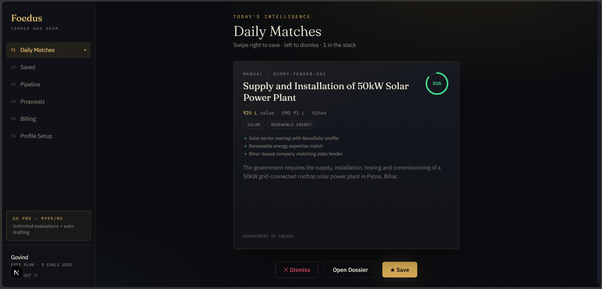
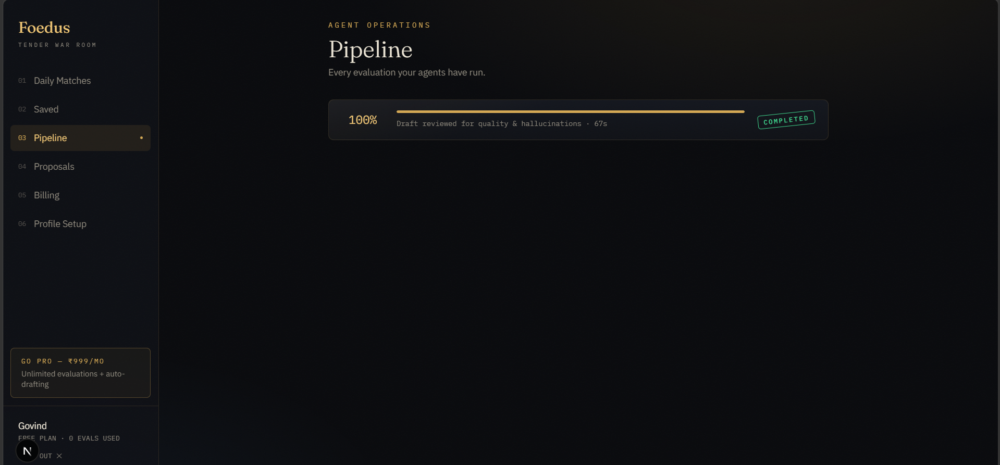
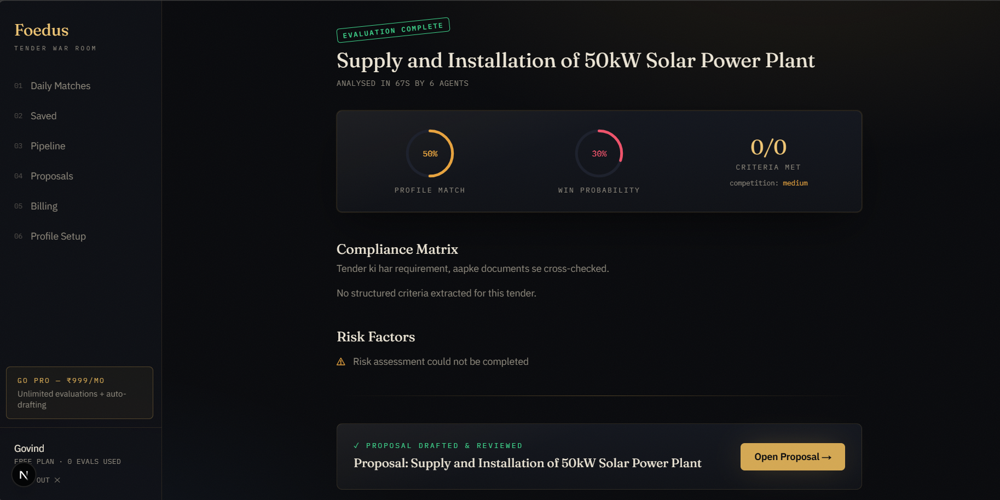
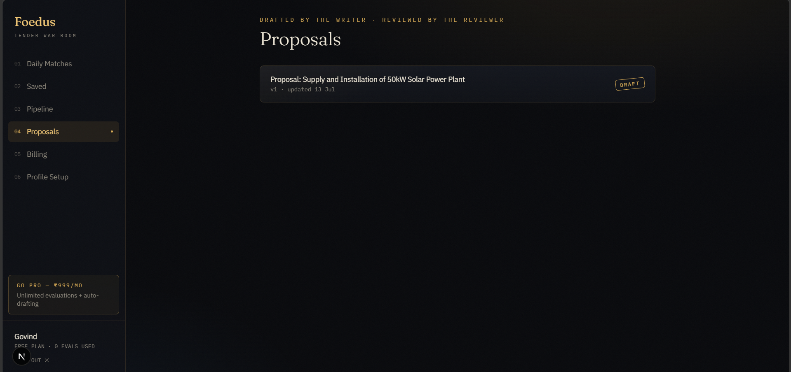
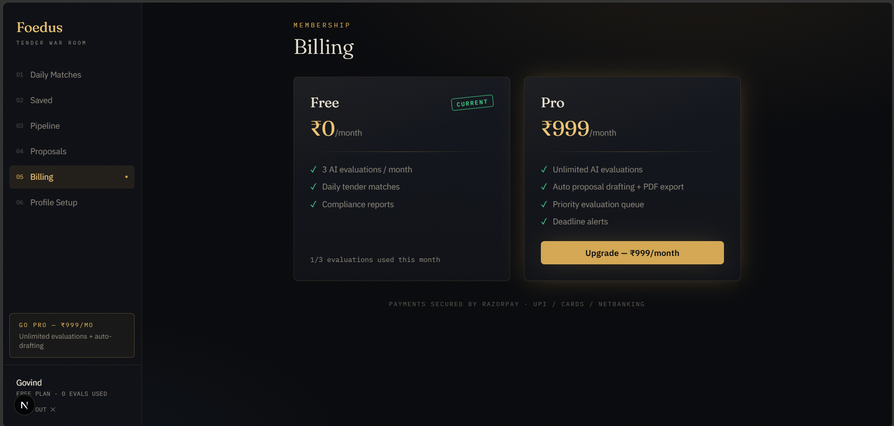

<div align="center">

# Foedus

### AI Tender Intelligence for Indian SMEs

*"Search the tender in minutes, not hours!"*

Six AI agents that scrape government tender portals, audit your eligibility with
**verified, grounded citations**, and draft a submission-ready proposal — in under two minutes.

[](https://python.org)
[](https://fastapi.tiangolo.com)
[](https://langchain-ai.github.io/langgraph/)
[](https://nextjs.org)
[](https://ai.google.dev)
[](LICENSE)

</div>

---

## The Problem

Indian government publishes tenders worth **lakhs of crores** every year across eprocure.gov.in, GeM, and CPPP. For a small business, participating means:

- Manually scanning multiple portals daily
- Reading **80-page tender PDFs** to find the eligibility section buried on page 40
- One missed clause (turnover certificate, EMD format, license copy) → **instant rejection**
- Days of effort writing a technical proposal from scratch

Foedus automates the entire funnel: **discover → match → audit → assess risk → draft → review**.

## The Product

### ✨ Magic Onboarding — no forms, just drop your brochure
The AI reads your company brochure PDF and builds your profile: sectors, turnover, certifications, past projects.


### 🎯 Daily Matches — Tinder for tenders
Every morning the scraper pulls fresh tenders and matches them against your profile. Swipe right to save, left to dismiss. Match score, EMD, deadline — sab card pe.



### 🤖 The 6-Agent Evaluation Pipeline
One click deploys six LangGraph agents with **live WebSocket progress**:

```
Preprocessor → Matchmaker → Auditor → Risk Assessor → Writer ⇄ Reviewer
                              ↑                          (revision loop)
                    the star: extracts every
                 eligibility criterion & cross-checks
                    against your document vault
```



### 📋 The Intelligence Report — with a hallucination firewall
Profile match, win probability, and a criterion-by-criterion compliance matrix.
**Every quote the AI cites is verified to actually exist in the tender document** — fabricated citations get flagged and downgraded, never silently trusted.



### ✍️ Auto-Drafted Proposals
If you clear the audit, the Writer agent drafts a technical proposal, a second agent reviews it (up to 2 revision rounds), and you export a styled PDF.



### 💳 Monetization built-in
Free tier (3 evaluations/month) → Pro at ₹999/month via Razorpay. Signature-verified payments with webhook safety net and automatic plan-expiry enforcement.



---

## Architecture

```
                    ┌──────────────────────────────────────────────┐
 Govt portals ──►   │ Scraper (cron 6AM) → OCR → Qdrant + Postgres │
                    └───────────────────┬──────────────────────────┘
                                        │
 Next.js 15  ──►  FastAPI  ──►  Celery + Redis  ──►  LangGraph (6 agents, Gemini)
  (Vercel)         │  ▲                │                     │
                   │  └── WebSocket ◄── Redis pub/sub ◄──────┘  (live progress)
                   ▼
            Compliance report + Proposal PDF
```

| Layer | Tech |
|---|---|
| Frontend | Next.js 15, React 19, TypeScript, Tailwind, Framer Motion |
| API | FastAPI (async), JWT auth, WebSockets, Pydantic v2 |
| Async | Celery + Redis (task queue + pub/sub progress) |
| AI | LangGraph, Gemini 1.5 Flash (structured outputs), BGE-M3 embeddings |
| Guardrails | Quote-grounding verification, score clamps, enum coercion, proposal lint |
| Data | PostgreSQL (Supabase), Qdrant (vectors) |
| Payments | Razorpay (HMAC-verified, webhook-backed) |
| Observability | LangSmith tracing, Loguru, Sentry |

## Hallucination Control (the part interviewers ask about)

A wrong compliance verdict can cost an SME a tender worth lakhs. So:

1. **Grounding verification** — every `source_quote` the Auditor cites is fuzzy-matched against the actual tender text (OCR-noise tolerant). Unverifiable quote → cleared, flagged, `met` verdict downgraded to `partial`.
2. **Eval harness with planted traps** — `make eval` runs agents against a golden tender fixture containing deliberate traps (requirements that *don't exist*). If the AI invents them, the eval fails. Metrics: criteria recall, status accuracy, grounding rate, hallucination count (must be 0).
3. **Structured outputs everywhere** — Gemini's native JSON schema mode + Pydantic validation + range clamps + enum coercion.
4. **Proposal lint** — strips AI meta-leakage ("As an AI…"), flags placeholders (`[INSERT X]`), detects repetition degeneration.

## Quick Start

```bash
git clone https://github.com/RintuRifle/foedus.git && cd foedus
cp .env.example .env                  # fill GEMINI_API_KEY at minimum

make infra-up                         # Postgres + Redis + Qdrant (Docker)
make install && make migrate
make dev                              # API → http://localhost:8000/docs
make worker                           # Celery worker (terminal 2)

cd frontend
npm install && cp .env.local.example .env.local
npm run dev                           # → http://localhost:3000
```

Seed tenders: `make scrape` (or insert manually for a demo).

### Tests & Evals
```bash
make test-guardrails     # 24 offline unit tests (no API key needed)
make eval                # live agent eval vs golden dataset (needs GEMINI_API_KEY)
```

## Deployment

One-click blueprint for Render (`render.yaml`: API + worker + cron scraper + Redis) with Vercel frontend, Supabase Postgres, and Qdrant Cloud — **~₹0/month** on free tiers. Full guide: [DEPLOYMENT.md](DEPLOYMENT.md).

## Project Structure

```
foedus/
├── backend/
│   ├── app/
│   │   ├── agents/       # 6-agent LangGraph pipeline + prompts + schemas
│   │   ├── routers/      # auth, tenders, evaluations, proposals, company, payments, ws
│   │   ├── services/     # LLM, OCR (Gemini Vision fallback), embeddings, vectorstore,
│   │   │                 #   Redis pub/sub progress
│   │   ├── tasks/        # Celery evaluation task
│   │   ├── utils/        # guardrails (hallucination firewall), billing, tracing, security
│   │   └── models/       # SQLAlchemy ORM
│   ├── evals/            # golden dataset + eval runner with hallucination traps
│   ├── tests/            # guardrail unit tests
│   └── Dockerfile
├── frontend/             # Next.js 15 — "The Dossier" design system
├── scraper/              # eprocure/GeM scrapers + dedup + PDF pipeline
├── render.yaml           # infra as code
└── DEPLOYMENT.md
```

## Roadmap

- [ ] State portal scrapers (UP, Maharashtra, Rajasthan)
- [ ] WhatsApp deadline alerts
- [ ] Multi-company support (consultants managing multiple SMEs)
- [ ] Hindi tender document support
- [ ] BOQ (Bill of Quantities) auto-fill

## License

MIT — build something useful with it.

---

<div align="center">
<i>Built for the person tired of reading 80-page tender PDFs at midnight.</i>
</div>
